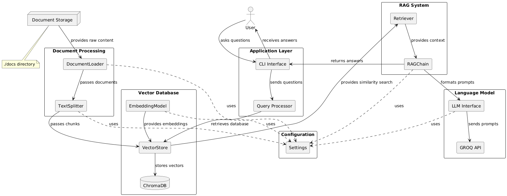

# RAG-Based AI Publication Agent

This is a Retrieval Augmented Generation (RAG) based AI system that answers questions based on provided documents. The system intelligently retrieves relevant information from text documents and generates accurate, context-aware responses using GROQ's language model.

## System Architecture



## How It Works

1. **Document Processing**: The system loads text documents from the `docs` directory, splits them into manageable chunks, and creates vector embeddings.
2. **Vector Storage**: These embeddings are stored in a ChromaDB vector database for efficient similarity search.
3. **Question Answering**: When a question is asked, the system:
   - Retrieves the most relevant document chunks based on semantic similarity
   - Passes these chunks along with the question to GROQ's language model
   - Returns a coherent answer based on the document content

## Features

- Load and process text documents from a directory
- Create embeddings using HuggingFace's sentence-transformers/all-MiniLM-L6-v2 model
- Store vectors in a ChromaDB vector database
- Answer questions using GROQ's LLM through a simple CLI interface
- Modular architecture for easy maintenance and extension
- Context-aware responses that cite information from documents

## Requirements

- Python 3.8+
- GROQ API Key (sign up at [groq.com](https://groq.com))
- Dependencies listed in `requirements.txt`

## Setup

1. Clone the repository:
   ```bash
   git clone [repository-url]
   cd rag-ai-assistant
   ```

2. Create a virtual environment:
   ```bash
   python -m venv .venv
   ```

3. Activate the virtual environment:
   ```bash
   # On macOS/Linux
   source .venv/bin/activate
   
   # On Windows
   .venv\Scripts\activate
   ```

4. Install dependencies:
   ```bash
   pip install -r requirements.txt
   ```

5. Set up your environment variables in a `.env` file:
   ```plaintext
   GROQ_API_KEY=your_groq_api_key
   ```

6. Create a `docs` directory (if not already present) and add your text documents (`.txt` files):
   ```bash
   mkdir -p docs
   # Add your .txt files to the docs directory
   ```

## Usage

1. Ensure you have added your text documents to the `docs` directory (with `.txt` extension).

2. Run the application:
   ```bash
   python app.py
   ```

3. The system will:
   - Load documents from the `docs` directory
   - Process and split them into chunks
   - Create embeddings and store them in the ChromaDB vector database
   - Start a CLI interface for asking questions

4. Enter your questions at the prompt to get answers based on your documents.

5. Type 'exit' or 'quit' to exit the application.

### Example Interaction:

```
RAG-based AI Publication Agent
------------------------------
Type 'exit' or 'quit' to exit the program.

Enter your question: What are the key components of a RAG system?

Thinking...

Answer: Based on the documents, the key components of a RAG system include a document loader, 
text splitter, embedding model, vector store, and language model. The document loader 
retrieves documents, the text splitter breaks them into manageable chunks, the embedding 
model creates vector representations, the vector store indexes these for retrieval, 
and the language model generates answers using the retrieved context.
```

## Configuration

Configuration settings can be found in `src/config/settings.py`. You can customize various aspects of the system:

### LLM Configuration

```python
# LLM Configuration
GROQ_API_KEY = os.getenv("GROQ_API_KEY")
GROQ_MODEL = "llama-3.1-8b-instant"  # Default model
```

You can change the GROQ model to any supported model like "llama-3.1-70b-instant" or "mixtral-8x7b-32768".

### Vector Database Configuration

```python
# Vector Database Configuration
CHROMA_PERSIST_DIRECTORY = "./chroma_db"
```

### Embedding Model Configuration

```python
# Embedding Model Configuration
EMBEDDING_MODEL = "sentence-transformers/all-MiniLM-L6-v2"
```

You can use other HuggingFace embedding models by changing this value.

### Document Settings

```python
# Document Configuration
DOCS_DIRECTORY = "./docs"
```

### Prompt Templates

The system uses configurable prompt templates that control how the AI responds:

- `SYSTEM_PROMPT`: Controls the overall behavior of the AI assistant
- `QUERY_PROMPT_TEMPLATE`: Controls how the AI uses the retrieved document context to answer questions

## Project Structure

```
.
├── app.py                   # Main application entry point
├── requirements.txt         # Project dependencies
├── README.md                # Project documentation
├── .env                     # Environment variables (create this file)
├── docs/                    # Directory for document storage (add .txt files here)
│   ├── ibm-multi-agent.txt      # Example document
│   └── readytensor-multi-agent.txt  # Example document
├── chroma_db/               # ChromaDB vector database storage
│   └── chroma.sqlite3       # SQLite database for vector storage
└── src/                     # Source code
    ├── __init__.py
    ├── config/              # Configuration settings
    │   ├── __init__.py
    │   └── settings.py      # Main configuration file
    ├── database/            # Vector database implementation
    │   ├── __init__.py
    │   └── vector_store.py  # ChromaDB implementation
    ├── models/              # LLM and RAG chain implementations
    │   ├── __init__.py
    │   ├── llm.py           # GROQ LLM implementation
    │   └── rag.py           # RAG chain implementation
    └── utils/               # Utility functions
        ├── __init__.py
        └── document_loader.py  # Document loading & processing
```

## Architecture

The application follows a modular architecture built on the LangChain framework:

1. **Document Loading**:
   - Uses LangChain's `DirectoryLoader` to load `.txt` files from the `docs` directory
   - Supports multiple text documents with automatic encoding detection

2. **Document Processing**:
   - Employs `RecursiveCharacterTextSplitter` to break documents into manageable chunks
   - Default chunk size of 1000 characters with 200 character overlap, configurable in `document_loader.py`

3. **Embedding**:
   - Creates numerical vector representations using HuggingFace's sentence-transformers model
   - Default model: `sentence-transformers/all-MiniLM-L6-v2` optimized for semantic search

4. **Storage**:
   - Stores embeddings in ChromaDB, a vector database for efficient similarity search
   - Persists data in `chroma_db` directory for reuse between application runs

5. **Retrieval**:
   - Uses similarity search to find the most relevant document chunks for a question
   - Retrieves top 3 most similar chunks by default (configurable in `rag.py`)

6. **Generation**:
   - Passes retrieved document chunks along with the query to GROQ's LLM
   - Uses customizable prompt templates to guide response generation
   - Returns concise, contextually appropriate answers based on document content

This architecture allows the system to provide accurate answers even to complex questions, by grounding the LLM's responses in your specific documents.

## Advanced Customization

### Changing the Retrieval Strategy

You can modify the retrieval strategy in `src/models/rag.py`:

```python
# Create a retriever from the vector store
retriever = vector_store.as_retriever(
    search_type="similarity",  # Try "mmr" for Maximum Marginal Relevance
    search_kwargs={"k": 3}     # Change number of retrieved chunks
)
```

### Document Chunking

Adjust document chunking parameters in `src/utils/document_loader.py` to optimize for your documents:

```python
def split_documents(documents):
    # Increase CHUNK_SIZE in settings for longer contexts
    # Increase CHUNK_OVERLAP in settings for better continuity between chunks
```

### Using Different LLMs

The system is built to use GROQ, but you can modify `src/models/llm.py` to use other LangChain-compatible LLMs like OpenAI, Anthropic, or local models.

## Troubleshooting

### No Documents Found

If you see "No documents found in ./docs directory":

- Ensure you have placed `.txt` files in the `docs` directory
- Check file extensions (only `.txt` is supported by default)
- Verify file permissions

### API Key Issues

If you encounter authentication errors:

- Ensure your GROQ API key is correctly set in the `.env` file
- Check that the `.env` file is in the root directory of the project
- Verify your API key is active on the GROQ platform

### Embedding Model Errors

If embedding model fails to load:

- Ensure you have internet connectivity (the embedding model is downloaded from HuggingFace)
- Try a different embedding model in `src/config/settings.py`


## Contributing

Contributions are welcome! Please feel free to submit a Pull Request.

